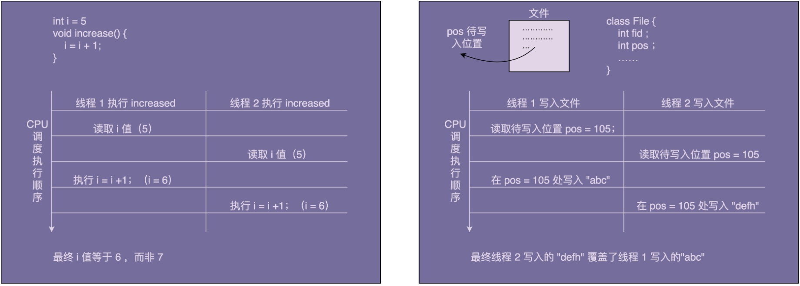

# 单例模式

*定义：一个类只允许创建一个对象（或者叫实例），那这个类就是一个单例类，这种设计模式就叫作单例设计模式，简称单例模式。*

## 1、为什么要使用单例？

### 1.1、处理资源访问冲突

```java

public class Logger {
  private FileWriter writer;
  private static final Logger instance = new Logger();

  private Logger() {
    File file = new File("/Users/wangzheng/log.txt");
    writer = new FileWriter(file, true); //true表示追加写入
  }
  
  public static Logger getInstance() {
    return instance;
  }
  
  public void log(String message) {
    writer.write(mesasge);
  }
}

// Logger类的应用示例：
public class UserController {
  public void login(String username, String password) {
    // ...省略业务逻辑代码...
    Logger.getInstance().log(username + " logined!");
  }
}

public class OrderController {  
  public void create(OrderVo order) {
    // ...省略业务逻辑代码...
    Logger.getInstance().log("Created a order: " + order.toString());
  }
}
```




自实现的日志基础类，在UserController、OrderController调用日志类时可能会造成日志覆盖的问题。

### 1.2、表示全局唯一类

```java
import java.util.concurrent.atomic.AtomicLong;
public class IdGenerator {
  // AtomicLong是一个Java并发库中提供的一个原子变量类型,
  // 它将一些线程不安全需要加锁的复合操作封装为了线程安全的原子操作，
  // 比如下面会用到的incrementAndGet().
  private AtomicLong id = new AtomicLong(0);
  private static final IdGenerator instance = new IdGenerator();
  private IdGenerator() {}
  public static IdGenerator getInstance() {
    return instance;
  }
  public long getId() { 
    return id.incrementAndGet();
  }
}

// IdGenerator使用举例
long id = IdGenerator.getInstance().getId();
```

Id生成器，各个系统使用这一套Id生成器，所以Id的唯一性很受考验

## 2、如何实现一个单例？

#### 实现单例需要考虑的问题：

1、构造函数需要是 private 访问权限的，这样才能避免外部通过 new 创建实例；

2、考虑对象创建时的线程安全问题；

3、考虑是否支持延迟加载；

4、考虑 getInstance() 性能是否高（是否加锁）。

#### 2.1、饿汉式

```java
public class IdGenerator { 
  private AtomicLong id = new AtomicLong(0);
  private static final IdGenerator instance = new IdGenerator();
  private IdGenerator() {}
  public static IdGenerator getInstance() {
    return instance;
  }
  public long getId() { 
    return id.incrementAndGet();
  }
}
```

#### 2.2、懒汉式

```java
public class IdGenerator { 
  private AtomicLong id = new AtomicLong(0);
  private static IdGenerator instance;
  private IdGenerator() {}
  public static synchronized IdGenerator getInstance() {
    if (instance == null) {
      instance = new IdGenerator();
    }
    return instance;
  }
  public long getId() { 
    return id.incrementAndGet();
  }
}
```

#### 2.3、双重检测

```java
public class IdGenerator { 
  private AtomicLong id = new AtomicLong(0);
  private static IdGenerator instance;
  private IdGenerator() {}
  public static IdGenerator getInstance() {
    if (instance == null) {
      synchronized(IdGenerator.class) { // 此处为类级别的锁
        if (instance == null) {
          instance = new IdGenerator();
        }
      }
    }
    return instance;
  }
  public long getId() { 
    return id.incrementAndGet();
  }
}
```

#### 2.4、静态内部类

```java
public class IdGenerator { 
  private AtomicLong id = new AtomicLong(0);
  private IdGenerator() {}

  private static class SingletonHolder{
    private static final IdGenerator instance = new IdGenerator();
  }
  
  public static IdGenerator getInstance() {
    return SingletonHolder.instance;
  }
 
  public long getId() { 
    return id.incrementAndGet();
  }
}
```

#### 2.5、枚举

```java
public enum IdGenerator {
  INSTANCE;
  private AtomicLong id = new AtomicLong(0);
 
  public long getId() { 
    return id.incrementAndGet();
  }
}
```

